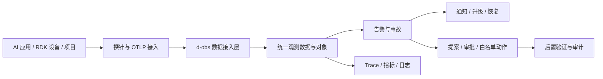
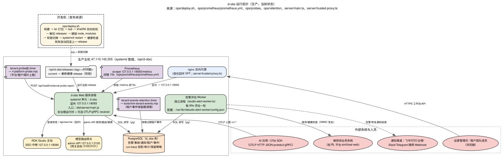
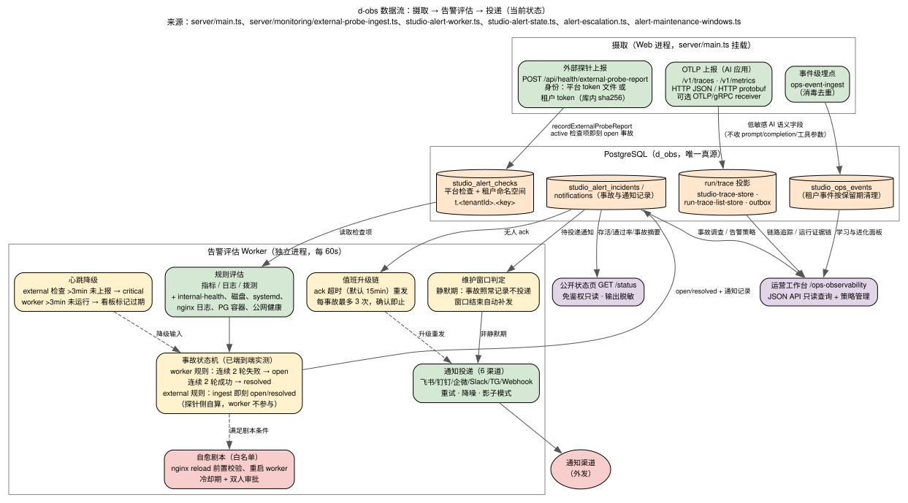
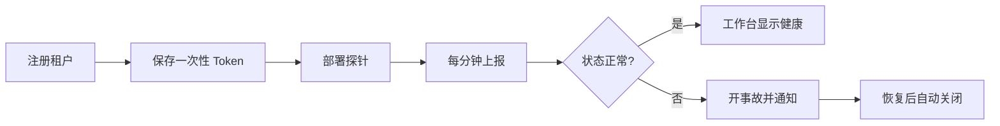

# d-obs 产品文档

**一句话定位**：面向 RDK、AI 应用和边缘设备的内部可观测与运营处置平台。

**使用对象**：平台运维、AI/Agent 开发、RDK 设备团队和项目负责人。  
**产品状态**：内部生产可用，持续演进中。  
**文档版本**：v1.1 · 2026-09-24

## 1. 我们要解决什么问题

当 AI 应用、模型网关、服务器和 RDK 设备分散运行时，团队很难快速回答：

- 哪个项目、服务或设备出了问题？
- 这是业务故障、模型故障、设备离线，还是探针失联？
- 一次 Agent Run 调用了什么模型和工具，慢在哪里、贵在哪里？
- 谁处理过故障，做了什么变更，变更是否真的生效？

d-obs 把这些信息汇总到一个工作台，并把“发现问题 → 定位问题 → 处理问题 → 验证恢复”串成一条可追溯链路。

## 2. 产品能做什么

| 模块 | 能力 | 用户得到的结果 |
| --- | --- | --- |
| 当前态势 | 服务、租户、设备、事故总览 | 先知道哪里不正常 |
| 巡检告警 | 指标、日志、内外部拨测、通知升级 | 故障自动发现并通知 |
| 事故调查 | 时间线、Trace、日志、指标、对象关联 | 快速缩小故障范围 |
| AI 观测 | OTLP traces、metrics、logs | 看清模型、工具和 Agent Run |
| 运营分析 | Token、成本、DAU、错误率、SLO | 判断稳定性和资源消耗 |
| 边缘设备 | 心跳、CPU、内存、温度、BPU | 知道设备是否在线、是否过载 |
| 模型池 | 目标健康、路由、fallback、回滚 | 模型服务切换更安全 |
| 行动闭环 | 提案、审批、白名单执行、后置验证 | 变更有证据、有边界 |

## 3. 一张图看懂系统

系统运行拓扑和数据流可以直接查看：

## 4. 最常用的三个场景

### 场景 A：接入一个新项目

最小接入步骤：注册租户、保存 Token、配置目标地址、启用 timer、在工作台确认状态。每个项目使用独立租户和独立凭证，停用或轮换后旧 Token 立即失效。

### 场景 B：调查一次 Agent 故障

1. 从事故进入相关 Run。
2. 查看 Trace 时间线、模型、工具、耗时和错误。
3. 对照指标和日志，确认问题属于服务、模型、设备还是网络。
4. 需要变更时提交带证据的动作提案。
5. 审批后执行白名单动作，等待后置验证。

### 场景 C：平台自身故障

异机看门狗独立检查 d-obs 的 `/status`。平台停止时由看门狗发出告警，恢复后发送恢复通知；数据库按小时备份，并保留异地副本。

## 5. 最佳实践

### 接入实践

- **一项目一租户一凭证**：不要多个项目共用探针 Token。
- **先影子、后外发**：新通知渠道先使用 shadow 模式，确认内容和频率后再打开真实投递。
- **保持探针简单**：优先检查 DNS、TLS、健康接口和入口页，不把业务逻辑塞进探针。
- **给服务补 `/healthz`**：健康检查只回答服务是否能工作，避免把深度业务查询放进健康接口。

### 告警实践

- **告警必须可行动**：每条规则都要对应负责人、处理入口和预期动作。
- **使用连续失败阈值**：短暂抖动不要立即开事故；恢复也要连续成功后再关闭。
- **维护窗口先配置**：发布和迁移期间静默通知，但继续记录事故，窗口结束后自动补发。
- **通知分级**：关键事故配置升级链，普通波动只进入工作台和日报。

### 观测实践

- **只采集低敏感字段**：保留模型、工具、耗时、状态和 Token；不要把 prompt、completion、工具参数和凭据写入 Trace。
- **统一对象身份**：使用服务、设备、机器人、站点、固件和模型版本等稳定字段关联数据。
- **看板少而固定**：默认只放健康率、错误率、P95、告警数、设备在线率和成本六类核心指标。
- **错误与慢请求优先保留**：高吞吐时启用尾部采样，错误和慢 Trace 永远保留。

### 处置与安全实践

- **不执行裸命令**：所有变更走提案、审批、白名单剧本和后置验证。
- **先验证再替换**：模型目标、通知地址和配置变更先做探测，失败不写入。
- **管理员与租户分开**：租户默认只读，平台管理员才管理配置和凭证。
- **每月做一次恢复演练**：备份存在不等于可恢复，必须实际恢复并抽查事故、租户和 Trace 数据。
- **平台必须被异机监控**：不能让 d-obs 只监控自己所在的主机。

## 6. 安全边界

- 管理、注册、租户和变更接口默认 fail-closed。
- 租户数据按 `tenant_id` 隔离。
- 探针和设备 Token 只保存哈希，明文只在签发响应中出现一次。
- 公开状态页脱敏，不暴露 Token、租户和通知通道信息。
- 观测数据按保留期清理，恢复时重放删除墓碑。

## 7. 当前成熟度

按“内部生产平台”标准，d-obs 已经成熟，当前可评为 **4.6/5**。

已经具备：完整告警和事故闭环、OTLP 接入、多租户隔离、边缘设备观测、受控行动、发布回滚、异机看门狗、小时级备份和恢复演练。

还需要持续加强的只有三类事情：

1. **高可用**：从单活跃主机升级到 PostgreSQL 热备和双活跃实例。
2. **容量证明**：对摄取、查询、通知链路做持续压测，明确规模上限。
3. **内部标准化**：沉淀团队接入模板、标准告警包、运行手册和故障演练流程。

## 8. 内部使用的验收标准

- 项目可以在 30 分钟内完成探针接入并在工作台看到状态。
- 故障能自动开事故，恢复能自动关事故并发送通知。
- 租户之间不能互读数据。
- 没有有效凭证时，管理和变更接口默认拒绝。
- 每个高风险动作都有审批和后置验证记录。
- d-obs 停止后，异机看门狗能在约定时间内报警。
- 最近一次备份可以真实恢复，并抽查关键表数据。
- 发布失败可以自动回滚。

## 9. 相关资料

- [项目 README](../README.md)
- [AI 原生接入说明](./ecosystem.md)
- [团队接入手册](./tenant-onboarding.md)
- [架构评审](./architecture/architecture-review.md)
- [运维手册](./operations.md)

